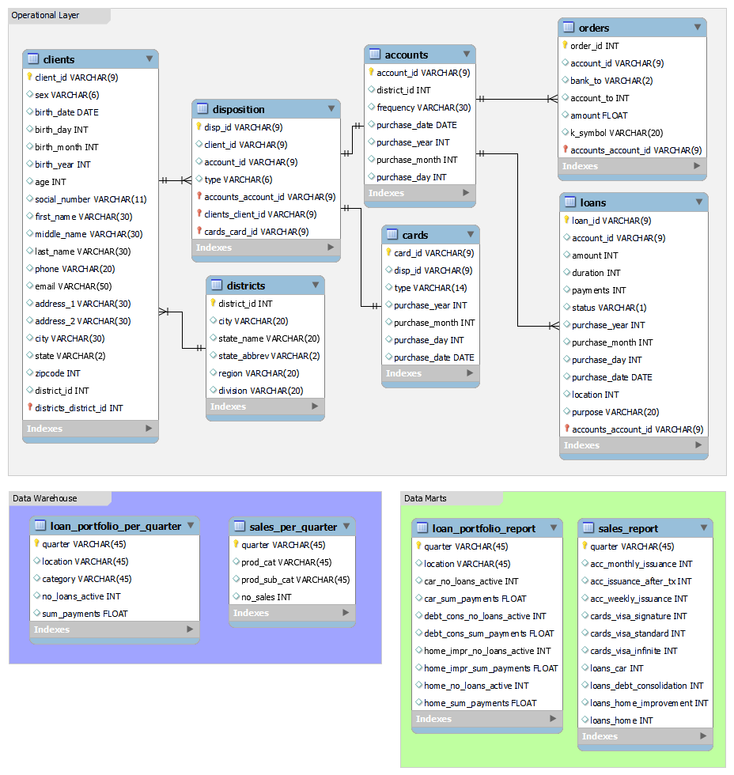

# Term 1 Assignment - Eagle Bank Database

### Overview of project
...

Current date: 2018-01-01

### Key points of management interest
#### Overview of loan portfolio over time per district
#### Overview of sales over time per district

### The Database
#### Description
The database created for this project consists of three main parts:
1. Operational layer: This is the layer of the database where everyday operations take place. All client and product data are read and written on a daily basis and kept up to date in very large data sets.
2. Data Warehouse (i.e. analytical layer): Necessary data for analytics from the Operational are extracted, loaded and transformed here. This layer contains aggregated, higher level data on the loan portfolio and sales.
3. Data Marts (i.e. views of analytical layer): This layer contains data views directly accessible by management. Data displayed here are digestable and easy to understand for management, as well as it is defined to fulfill specific business requirements.

#### Model

	

#### Side note about products
Clients can have 3 general types of products:

- Accounts
	- Monthly issuance
	- Issuance after transaction
	- Weekly issuance
- Cards
	- VISA Signature
	- VISA Standard
	- VISA Infinite
- Loans
	- Duration: 12, 24, 36, 48, 60 months
	- Status: A, B, C, D
	- Purpose: Car, Debt Consolidation, Home Improvement, Home

#### Description of data transformations
##### Data warehouse
###### `loan_portfolio_per_quarter`
###### `sales_per_quarter`

##### Data marts
###### `loan_portfolio_report`
###### `sales_report`

### How to Reproduce the Project

1. Software: MySQL, MySQL WorkBench, Git
2. Creating Operational Layer: The source files need to be copied to the upload folder within MySQL software folder
3. Creating Data Marts: Data Marts should be automatically created by running the attached .SQL script

