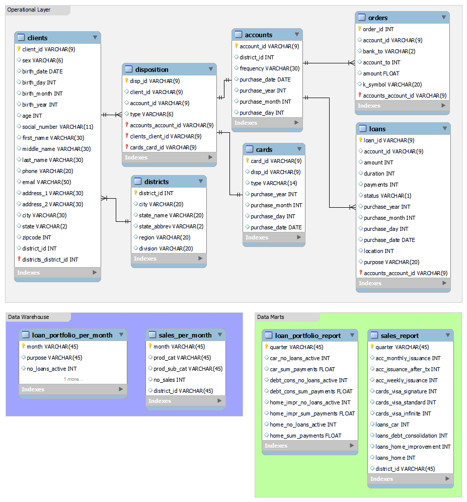

# Term 1 Assignment - Eagle Bank Database

### Overview of project
The goal of this project was to build a database with three layers (operational layer, data warehouse, data marts) on a real-life dataset. I chose the Eagle Bank relational database, an actual banking database available on data.world for this task:
https://data.world/lpetrocelli/retail-banking-demo-data

The dataset contains 12 tables, out of which I skipped the ones that were either not needed for the assignment, or were too large to upload to github (this was the case with the `completedtrans.csv` file. The tables I left for the term project can be seen in the data model below.

Note: The fictional current time for this project is 2018-01-01. This is because the dataset is a couple of years old and this current time made sense considering the data when looking at time series.

### Main questions
Main questions to be answered by the data warehouse and the data marts are the following (coming from the management of Eagle Bank):
1. Please show us an overview of our loan portfolio (with respect to sub-categories of loans) over the past few years
2. Please show us an overview of our sales (in each product types and product subtypes) per district over the past few years

Note: product types (subtypes) are the following: 
- Accounts (monthly issuance, issuance after transaction, weekly issuance)
- Cards (VISA Signature, VISA Standard, VISA Infinite)
- Loans (car, debt consolidation, home improvement, home)

### The Database
The database created for this project consists of three main parts:
1. Operational layer: This is the layer of the database where everyday operations take place. All client and product data are read and written on a daily basis and kept up to date in very large data sets.
2. Data Warehouse (i.e. analytical layer): Necessary data for analytics from the operational layer are extracted, transformed and loaded into this layer. It contains aggregated, higher level data on the loan portfolio and sales.
3. Data Marts (i.e. views of analytical layer): This layer contains data views directly accessible by management. Data displayed here are digestable and easy to understand for management, as well as it is defined to fulfill specific business requirements.

#### Visualization of data model

	

#### ETL
Each of the tables `loan_portfolio_per_month`, `sales_per_month` and `views loan_portfolio_report`, `sales_report` are created using procedures in the SQL script. There are additional triggers that re-run these procedures if the corresponding tables in the operational layer are updated.

### How to Reproduce the Project
1. Install software: MySQL, MySQL WorkBench, Git
2. Start MySQL server
3. Create Operational Layer: Copy the source files to the upload folder within MySQL software folder. Run Step 1 of the sql sciprt `./sql/Term1_project`.
4. Creating Data Warehouse and Data Marts: Run Step 2-4 of the sql sciprt `./sql/Term1_project`.
