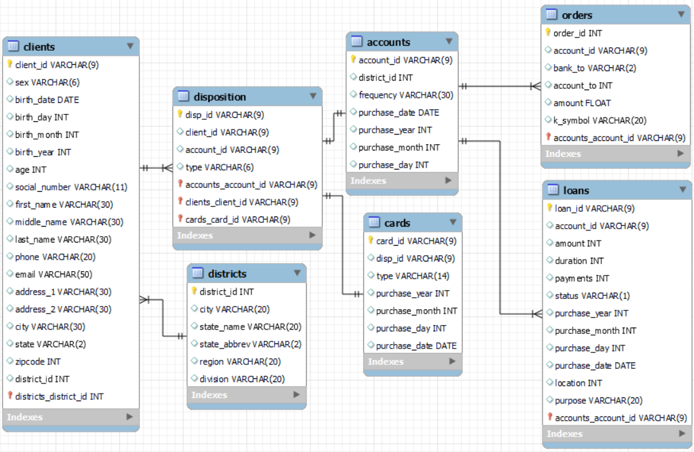

# Term 1 Assignment for Data Engineering 1: SQL and Different Shapes of Data

## Overview of Project
...

## Description of Data Set
...

Current date: 2018-01-01

Clients can have 3 general types of products:

- Accounts
	- Monthly issuance
	- Issuance after transaction
	- Weekly issuance
- Cards
	- VISA Signature
	- VISA Standard
	- VISA Infinite
- Loans
	- Duration: 12, 24, 36, 48, 60 months
	- Status: A, B, C, D
	- Purpose: Car, Debt Consolidation, Home Improvement, Home

## Questions of Interest by Management:
- Overview of loan portfolio over time (per quarter), with projections for the future
- Overview of sales over time per district (per quarter)
- Current 

- How are clients distributed within different business-relevant age groups, what their product penetration rates are, and how profitable (based on paid loan interest) they are.
- How did product penetration and profitability change over time?
- Management is interesten in where our clients transact the most to

- where are our clients distributed?
- where do our clients transact most to? (orders)
- what was our income from loans in the past x years?

## Results
...

## How to Reproduce the Data & Analysis
### Important notes

## Data Source

## Operational Layer
Note:s ecure-file-priv has to be disabled in MySQL before running the script. To achieve this, go to your MySQL directiory (e.g. C:\ProgramData\MySQL\MySQL Server 8.0\),
where you will find the my.ini file. Open the file in text editor (you may need admin privileges to do this), and set the secure-file-priv parameter to "" (secure-file-priv="").
Restart your mysql service. Or as alternative you can copy files to approved directory by MySQL WorkBench.

...

## Analytical Layer
...

## Data Markts as Inputs to Visualization Tools
...

Notes / can improve:
- relative path to raw data files
- have to come up with better namings for dates (not all dates can be expiry)... especially for loans it doesn't make sense (it doesn't add up for duration + year to be 
duration of loan + expiry date of loan.)
- how to ETL to data markts: create materialized views for 1 of the data markt with most complex data & longest query time

