# Term 2 Assignment - GDP models for Austria, France, Germany, Hungary and the United Kingdom 

## Motivation

The purpose of this project is to build a model that allows estimating the impact of the different macroeconomic variables and in 5 countries in the European Union. Based on the expenditure method, we will measure the impact of Government spending, Investment, household consumption and net exports on the countries’ GDP. Using information from the World Bank during the period 1980-2019, we will estimate the equation for GDP using a multiple regression model.

## Description

One of the most common indicators to measure the economic performance of a country is the gross domestic product (GDP). This indicator seeks to reflect all the income and expenses in goods and services of a country in a period. There are different ways to calculate GDP, for our work we will focus on the expenditure method. This method aggregates the expenditures of the different economic actors (Households, Companies, Government, and external market), and it is formulated in the following way:

GDP = C + I + G + X - M

GDP: Gross domestic product  
C: Household expenditures  
I: Private sector expenditures  
G: Public sector expenditures  
X: Exports  
M: Imports

## Model 

Our model consists of a multiple regression by ordinary least squares (OLS). The dependent variable corresponds to GDP and the independent variables to the expenditure of the sectors described in the previous section (Households, Companies, government, exports and imports). We will use quarterly data extracted from the database of the European statistics office (Eurostat) of Germany, France, UK, Hungary, and Austria. All variables are in millions of euros at current prices. In addition, the variables are seasonally adjusted to eliminate the influence of cyclical phenomena in our analysis.

	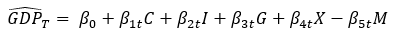  

	<b>Figure 1. Regression model formula</b>

## Source data & data model
We had two main sources for our data:
1. A table containing seasonally adjusted quarterly GDP values per country in a MySQL database (`macroeconomic_db.gdp`). This dataset was downloaded using the Data Browser application of Eurostat (see: https://ec.europa.eu/eurostat/databrowser/view/namq_10_gdp/default/table?lang=en).

	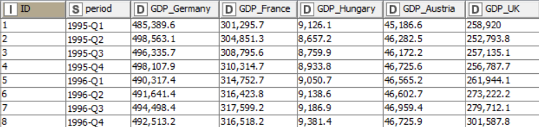  

	<b>Figure 2. Table structure of DB table</b>

2. An API call for quarterly C, I, G, X and M per country to the Eurostat servers using their REST API (https://ec.europa.eu/eurostat/web/json-and-unicode-web-services/getting-started/rest-request).

	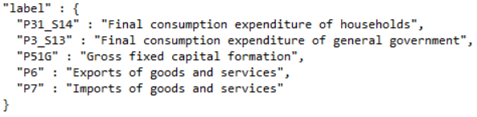  

	<b>Figure 3. JSON structure of input API call: Variable names (C, I, G, X, M)</b>

	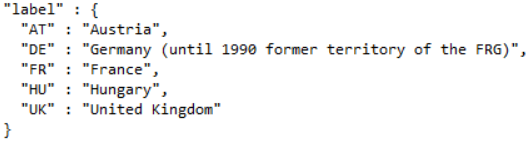  

	<b>Figure 3. JSON structure of input API call: Countries (C, I, G, X, M)</b>

	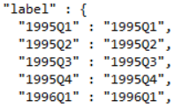  

	<b>Figure 3. JSON structure of input API call: Time</b>

	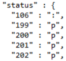  

	<b>Figure 3. JSON structure of input API call: Status</b>

	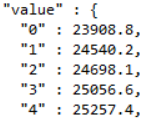  

	<b>Figure 3. JSON structure of input API call: Value</b>

All data are in millions of Euros in current prices and are seasonally adjusted.

## Data preparation and regression modeling
The complete workflow in Knime is displayed in Figure 4:

	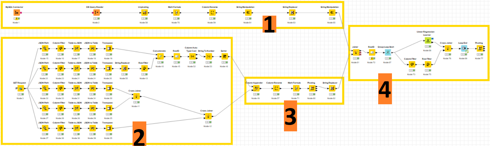  
	

	<b>Figure 4. Complete Knime workflow.</b>

### Sections of Knime workflow:
#### 1. Importing table with gdp data from the relational database

	  
	

	<b>Figure 5. DB input flow.</b>

#### 2. Calling Eurostat REST API, importing and formatting different parts of the JSON file.

	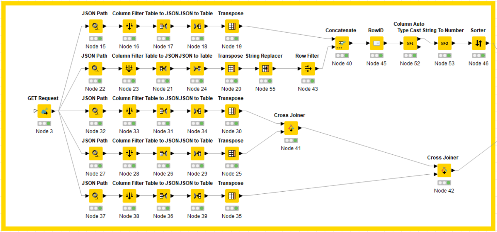  
	

	<b>Figure 6. API input flow.</b>

#### 3. Joining different parts of JSON file into one final table, and preparing this table for analysis.

	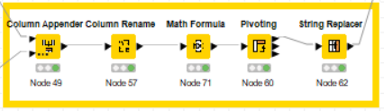  
	

	<b>Figure 7. Preparing API input data.</b>

#### 4. Final data preparation and modeling in a loop, outputting beta coefficients in a final table.

	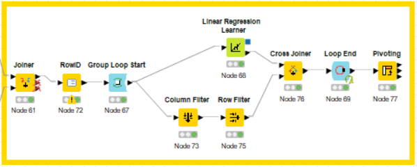  
	

	<b>Figure 8. Data join and modeling.</b>

## Results
