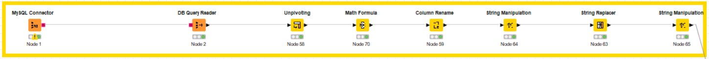

# Term 2 Assignment: GDP models for Austria, France, Germany, Hungary and the United Kingdom 

## Division of Labor & Reproducibility	

**Project done by: Natalia Iriarte, Balint Bojko**  
**Natalia:** Project idea, GDP and Regression model description, SQL database creation, Presentation of results and conclusion  
**Balint:** API calls, Knime Workflow, Technical Documentation
	
How to Reproduce the Project
1. Install software: MySQL, MySQL WorkBench, Git, Knime
2. Start MySQL server
3. Create Operational Layer: Copy the .csv file (`./csv/gdp.csv`) to the upload folder within MySQL software folder. Run sql script (`./sql/Term1_project`).
4. Open Knime Workflow (`./knime/knime_workflow.knwf`)
5. Change authentication (server address, login name & pw) for the MySQL Connector node so that it can access your MySQL server
5. Run Knime Workflow
	
## Short Overview of Project

The purpose of this project is to build a model that allows estimating the impact of the different macroeconomic variables and in 5 countries in the European Union. Based on the expenditure method, we will measure the impact of Government spending, Investment, household consumption and net exports on the countries’ GDP. Using information from Eurostat during the period 1995-2021, we will estimate the equation for GDP using a multiple regression model.

## Description of GDP

One of the most common indicators to measure the economic performance of a country is the gross domestic product (GDP). This indicator seeks to reflect all the income and expenses in goods and services of a country in a period. There are different ways to calculate GDP, for our work we will focus on the expenditure method. This method aggregates the expenditures of the different economic actors (Households, Companies, Government, and external market), and it is formulated in the following way:

GDP = C + I + G + X - M

GDP: Gross domestic product  
C: Household expenditures  
I: Private sector expenditures  
G: Public sector expenditures  
X: Exports  
M: Imports

## Definition of Regression Model

Our model consists of a multiple regression by ordinary least squares (OLS). The dependent variable corresponds to GDP and the independent variables to the expenditure of the sectors described in the previous section (Households, Companies, government, exports and imports). We will use quarterly data extracted from the database of the European statistics office (Eurostat) of Germany, France, UK, Hungary, and Austria. All variables are in millions of euros at current prices. In addition, the variables are seasonally adjusted to eliminate the influence of cyclical phenomena in our analysis.

	  

	<em>Figure 1. Regression model formula</em>

## Source Data
All data we used were in millions of Euros in current prices and were seasonally adjusted.  

**We had two main sources for our data:**
	
#### 1. A table containing seasonally adjusted quarterly GDP values per country in a MySQL database (`macroeconomic_db.gdp`). 
This dataset was downloaded using the Data Browser application of Eurostat.  
(https://ec.europa.eu/eurostat/databrowser/view/namq_10_gdp/default/table?lang=en)

	  

	<em>Figure 2. Table structure of DB table</em>

#### 2. An API call for quarterly C, I, G, X and M per country (as defined under "Description") to the Eurostat servers using their REST API (https://ec.europa.eu/eurostat/web/json-and-unicode-web-services/getting-started/rest-request). 
The received JSON file was formatted according to the JSON-stat format used by many statistical organizations such as the statistical institutes of Sweden, the UK, Denmark, the World Bank, etc. (https://json-stat.org/format/). Labels of aggregation dimensions and numerical data were stored in separate parts of the received JSON file. We had to cross-join the labels of the aggregation dimensions to receive a full set of numerical data labels. We had to combine records from under the `value` and `status` keys to get the full set of numerical data. Then, we had to combine the full set of numerical data labels with the full set of numerical data. Since the JSON file did not contain any redundancy (i.e. did not story any aggregation dimension more than once), the API part of our dataset had to be processed in a relatively complex manner with multiple steps. A glimpse of the original (sub-)structure of the JSON file can be seen in Figure 3-7 below.

	
**Converting the JSON data to useful format for modeling, step 1:** In order to convert the data into usable format for modeling, first the aggregation dimensions (variable names, country names and time name) had to be cross-joined to have a full list of usable record labels for numeric values (Figure 3-5):

	  

	<em>Figure 3. JSON structure of input API call: Variable names (C, I, G, X, M)</em>

  
	
	

	  

	<em>Figure 4. JSON structure of input API call: Countries (C, I, G, X, M)</em>

  
	
	

	  

	<em>Figure 5. JSON structure of input API call: Time</em>

  

**Converting the JSON data to useful format for modeling, step 2:** As a second step, records under the `status` key (containing records with empty values), and under the `value` key (containing records with non-empty values) had to be joined, in order to create a full set of numeric records for each combination of the aggregation dimensions (Figure 6-7):  
	

	  

	

	<em>Figure 6. JSON structure of input API call: Status</em>

  
	
	

  
	

	  

	<em>Figure 7. JSON structure of input API call: Values</em>

**Converting the JSON data to useful format for modeling, step 3:** Finally, sets of data produced by step 1 and step 2 had to be combined to get the labeled set of input variables for the model in a long tabular format.

## Knime Workflow: Data Preparation and Fitting the Regression Model
The complete workflow in Knime is displayed in Figure 4:

	  
	

	<em>Figure 8. Complete Knime workflow.</em>

### Sections of Knime workflow:
#### 1. Importing table with gdp data from the relational database (Figure 9)  

1. MySQL Connector, DB Query Reader: connect to mysql server, select everything from `macroeconomic_db.gdp`  
2. Unpivoting: convert to long format  
3. Math Formula: log transformation of gdp data  
4. Column Rename: standardize column names  
5. String Manipulation, String Replacer: standardize country names  
6. String Manipulation: standardize format of time column  

	  
	

	<em>Figure 9. DB input flow.</em>

#### 2. Calling Eurostat REST API, importing and formatting different parts of the JSON file.

1. GET Request: get JSON file from Eurostat REST API
2. JSON Path (multiple paths): locate paths of interest to export content displayed in Figure 3-7
3. Column Filter, Table to JSON, JSON to Table, Transpose (multiple paths): get content of JSON in tabular format
4. String Replacer, Row Filter, Concatenate, RowID, Column Auto Type Cast, String to Number, Sorter: combine values under `status` and `value` keys, reformat and sort
5. Cross Joiner, Cross Joiner: cross join labels of aggregation dimensions (i.e. labels under `na_item`, `geo` and `time` keys)

	  
	

	<em>Figure 10. API input flow.</em>

#### 3. Joining different parts of JSON file into one final table, and preparing this table for analysis.
1. Column Appender: join numerical data labels with numerical data
2. Column Rename: standardize column names
3. Math Formula: log transformation of independent variables
4. Pivoting: get data in semi-long format
5. String replacer: standardize country names

	  
	

	<em>Figure 11. Preparing API input data.</em>

#### 4. Final data preparation and modeling in a loop, outputting beta coefficients in a final table.
1. Joiner: join dependent & independent variables for modeling
2. Group Loop Start: start looping through countries
3. Column Filter, Row Filter: save country name within loop
4. Linear Regression Learner: fit linear regression for country
5. Cross Joiner: add country name to obtained coefficients
6. Loop end: end loop
7. Pivoting: reformat coefficient data to more digestable format

	  
	

	<em>Figure 12. Data join and modeling.</em>

## Results
The result of the regressions shows us that the variable with the greatest impact on GDP in the 5 countries is household spending. The UK economy is especially sensitive to this ruble as a 1% increase in household spending would imply a 0.66% increase in GDP. In the case of Hungary, the coefficients show that GDP is significantly more sensitive to the external sector than the rest of the countries. A 1% increase in exports would increase GDP by 0.59%, otherwise a 1% increase in Hungary's imports would decrease GDP by 0.5%. The coefficient of government spending in the German economy indicates that the country's GDP has very low responses to expansive fiscal policies.
	

